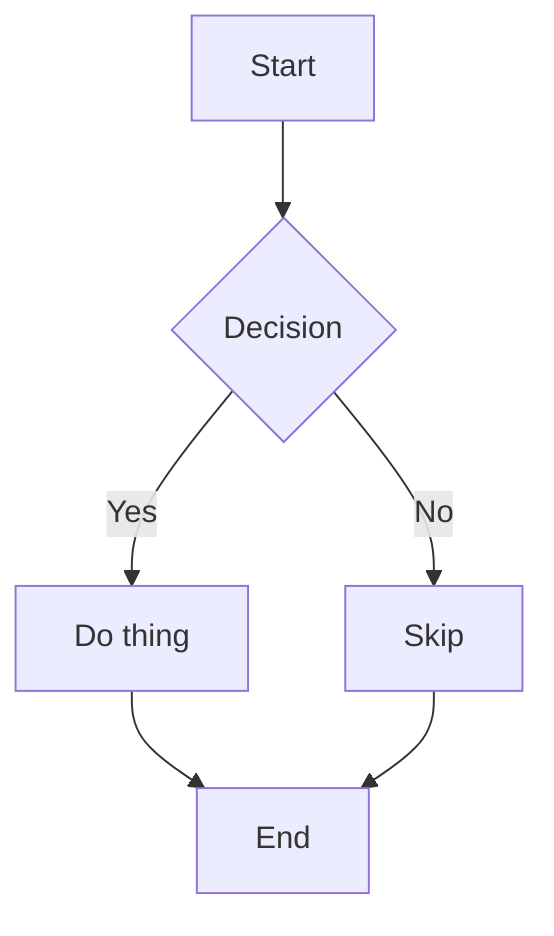
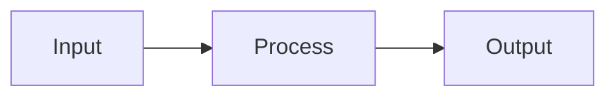
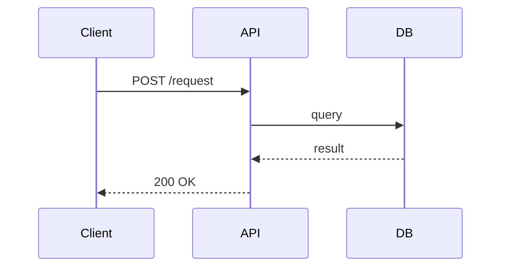
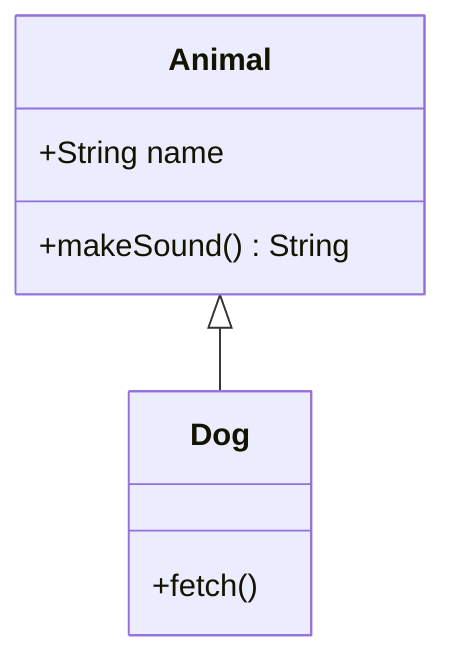
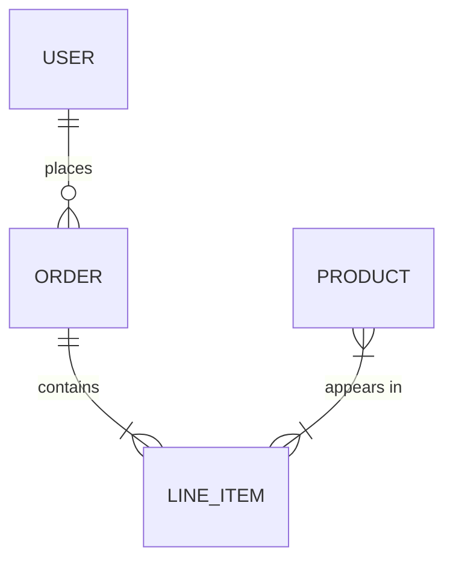
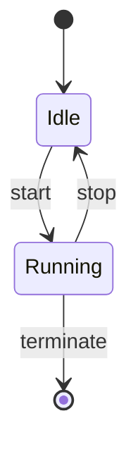
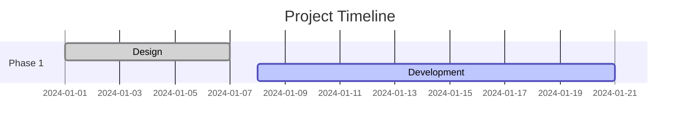
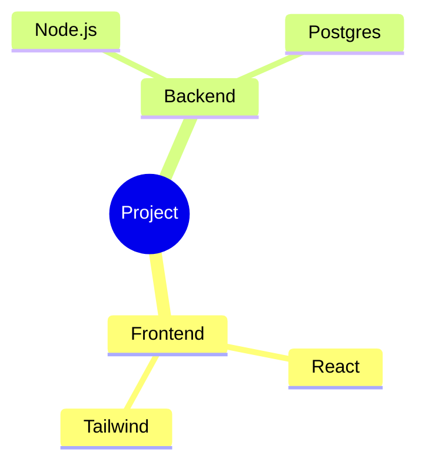
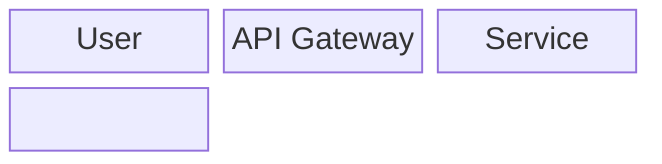

## What I do
- Generate MermaidJS diagrams for embedding in GitHub markdown files (`.md`)
- Create diagrams on Miro boards using the Miro MCP server tools
- Choose the right diagram type for the task: flowcharts, sequence, class, ER, state, Gantt, mindmap, etc.
- Always prefer MermaidJS output first; fall back to Miro MCP only when explicitly asked or when the diagram complexity exceeds Mermaid's capabilities

## When to use me
Use when asked to draw, diagram, visualize, or chart anything — architecture, flows, sequences, data models, state machines, timelines, etc.

---

## Output preference: MermaidJS first

**Default to MermaidJS** for all diagrams. MermaidJS renders natively in GitHub markdown, PRs, issues, wikis, and README files with no external tools required.

Wrap all Mermaid diagrams in a fenced code block:

````markdown

````

---

## MermaidJS diagram types

### Flowchart

- Use `TD` (top-down) or `LR` (left-right)
- Shapes: `[rect]`, `(rounded)`, `{diamond}`, `[(cylinder)]`, `[/parallelogram/]`
- Edge labels: `-->|label|`

### Sequence diagram


### Class diagram


### Entity-relationship diagram


### State diagram


### Gantt chart


### Mindmap


### Architecture (C4 / block)


---

## Miro MCP server

Use the Miro MCP server when:
- The user explicitly asks to put a diagram on a Miro board
- Collaborative or interactive whiteboard output is needed
- The diagram is too complex for Mermaid syntax

### OpenCode config to add Miro MCP

Add to `opencode.json` (or `~/.config/opencode/config.json` for global):

```json
{
  "mcp": {
    "miro": {
      "type": "remote",
      "url": "https://mcp.miro.com/",
      "enabled": true
    }
  }
}
```

Then authenticate once:
```
opencode mcp auth miro
```

This triggers OAuth 2.1 — select your Miro team when prompted.

### Miro MCP available tools

| Tool | Description |
|------|-------------|
| `diagram_create` | Create a diagram on a board from DSL text |
| `diagram_get_dsl` | Get syntax/rules for a diagram type before creating |
| `context_explore` | List frames, docs, prototypes on a board |
| `context_get` | Get text content from a specific board item |
| `board_list_items` | List board items with pagination |
| `doc_create` | Create a structured doc on a board |
| `doc_get` | Read markdown content of a board doc |
| `doc_update` | Edit content in an existing board doc |
| `image_get_url` | Get download URL for a board image |
| `table_create` | Create a table on a board |

### Miro MCP supported diagram DSL types
- `flowchart` — general flow and process diagrams
- `uml-class` — class and object relationships
- `uml-sequence` — interaction sequences between components
- `erd` — entity-relationship data models

Always call `diagram_get_dsl` first to get the exact syntax rules before calling `diagram_create`.

### Miro MCP workflow

1. Call `context_explore` to find the right board/frame if not provided
2. Call `diagram_get_dsl` with the target diagram type to get syntax rules
3. Call `diagram_create` with the DSL content and board ID

---

## Decision guide

| Scenario | Use |
|----------|-----|
| Embedding in a README or `.md` file | MermaidJS |
| GitHub PR description or issue | MermaidJS |
| User says "put it on the Miro board" | Miro MCP |
| Collaborative whiteboard session | Miro MCP |
| Complex diagram with custom layout | Miro MCP |
| Quick architecture sketch in docs | MermaidJS |

---

## Key conventions
- Always output MermaidJS in a fenced ` ```mermaid ` code block so GitHub renders it
- Prefer `flowchart` over deprecated `graph` syntax in Mermaid
- Use `sequenceDiagram` for API/service interaction flows
- Use `erDiagram` for database schemas and data models
- Keep node labels short and descriptive — avoid special characters that break Mermaid parsing
- Test Mermaid syntax at https://mermaid.live before finalizing complex diagrams
